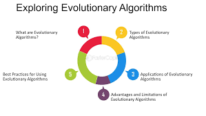

Introduction  

---
Do you remember learning about evolution in science class?    It seemed like just a biology topic, but natural selection in evolution is a powerful optimization process, tested over millions of years, where only the most adapted organisms survive.     Now, I will introduce the evolutionary algorithm, which is inspired by this principle of natural selection.

### 1)   What is an Evolutionary Algorithm?  
In nature, evolution works through variation and natural selection, where the organisms best adapted to their environment survive.     An evolutionary algorithm is an optimization method that mimics natural selection.    It applies variation, selection, and recombination to candidate solutions across generations to gradually discover better answers.

### 2)   How It Works  
The working principle is a simple cycle.       First, random solutions are generated and scored.     Then, the higher scoring solutions are selected.      This is the survival of the fittest step.       The selected solutions are combined and slightly modified to create the next generation.       Repeating this process improves the quality of solutions over time.

### 3)   Real World Applications  
This algorithm is applied in many areas around us.    For example, it helps optimize aircraft wing design, find the shortest routes for logistics, and automatically generate complex class schedules.   In medicine and biology, it is also used in genome analysis and drug candidate discovery.   In short, it is useful for solving complex problems without a single fixed answer.

### 4)   Strengths and Limitations  
Of course, there are clear strengths and limitations.   It can flexibly handle complex problems and has a higher chance of finding global solutions, which is a major strength.   However, because it is based on probability, it cannot guarantee a perfect answer, and since it requires many generations, it can sometimes be slow.

### 5)   Conclusion  
In conclusion, evolutionary algorithms are powerful optimization tools inspired by nature’s wisdom. They offer creative and effective solutions to complex problems that are difficult to solve with traditional methods.   Combined with artificial intelligence, especially deep learning and machine learning, they are expected to offer greater possibilities.   Thank you.

  
.  
.  
.  
.  
.  
.  
.  
.  
.  
.  
.  
.  
.  
.  
.  
.  
.  
.  
.  
.  
.  
.  
.  

  
---  
슬라이드 2: 도입  

과학 시간에 배운 진화 기억하시나요?   단순히 생물학 이야기처럼 보였을 수도 있지만,  진화에서 자연선택은 수백만 년 동안 검증된 강력한 최적화 과정으로, 환경에 가장 잘 적응한 생물만 살아남는 원리입니다.   이번 발표의 주제는 바로 이 자연선택의 원리에서 영감을 얻어 탄생한 진화 알고리즘입니다.    이제, 바로 이 자연선택의 원리에서 영감을 얻은 진화 알고리즘을 소개하겠습니다.

슬라이드 3: 진화 알고리즘이란?  

자연에서 진화는 변이와 자연선택을 통해 이루어지며, 환경에 가장 잘 적응한 생물이 살아남습니다.   진화 알고리즘은 이 자연선택의 과정을 모방한 최적화 방법입니다.     해답 후보에 변이·선택·재조합을 세대에 걸쳐 적용하면서 점차 더 나은 해답을 찾아갑니다.

슬라이드 4: 작동 원리  

작동 원리는 단순한 순환 과정입니다. 먼저 무작위 해답을 생성하고 점수를 매깁니다.   그 다음, 점수가 더 높은 해답을 선택하는데, 이것이 바로 적자생존 단계입니다.    선택된 해답들은 서로 결합되고 약간 변형되어 다음 세대를 만듭니다.     이 과정을 반복하면 시간이 지남에 따라 해답의 품질이 점차 향상됩니다.

슬라이드 5: 실제 활용 분야  

이 알고리즘은 우리 주변의 다양한 분야에 적용됩니다.     예를 들어, 항공기 날개 설계를 최적화하고, 물류 배송의 최단 경로를 찾으며, 복잡한 강의 시간표를 자동으로 생성하는 데 사용됩니다.     의학·생명 분야에서도 유전체 분석이나 신약 후보 물질 발굴에 활용됩니다.     즉, 하나의 정답이 없는 복잡한 문제 해결에 유용합니다.

슬라이드 6: 장점과 한계  

물론 장점과 한계가 있습니다.     복잡한 문제에 유연하게 대응할 수 있고, 전체적으로 더 좋은 해를 찾을 가능성이 높다는 점이 큰 장점입니다.     하지만 확률에 기반하기 때문에 완벽한 정답을 보장하지 못하며, 수많은 세대를 거쳐야 하므로 때로는 속도가 느려질 수 있습니다.

슬라이드 7: 결론  

결론적으로, 진화 알고리즘은 자연의 지혜에서 영감을 얻은 강력한 최적화 도구입니다.     기존 방법으로 풀기 어려운 복잡한 문제에 대해 창의적이고 효과적인 해법을 제시합니다.     또한 인공지능, 특히 딥러닝과 머신러닝과 결합되어 더 큰 가능성을 제공할 것으로 기대됩니다. 감사합니다.

